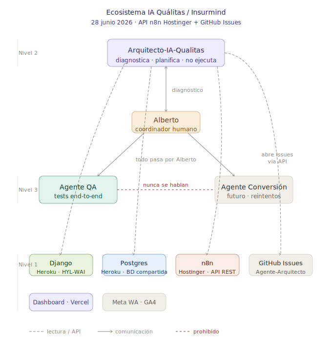

# Agente-Arquitecto — Ecosistema IA Quálitas/Insurmind

Repositorio raíz del **Arquitecto-IA-Qualitas**, agente de Nivel 2 del ecosistema multiagente de Insurmind.

## Arquitectura

## Qué contiene este repo

| Archivo / carpeta | Propósito |
|---|---|
| `CLAUDE.md` | Fuente de verdad del ecosistema. El Arquitecto lo lee al inicio de cada sesión. |
| `ARQUITECTURA_AGENTES.md` | Decisiones de arquitectura multi-agente y reglas de comunicación. |
| `BUGS_N8N.md` | Bugs cross-sistema confirmados con evidencia de base de datos. |
| `PREGUNTAS_HYLANT.md` | Preguntas abiertas de negocio pendientes de respuesta de Hylant. |
| `docs/diagrama-agentes.svg` | Diagrama visual de la arquitectura de agentes y sistemas. |
| `ejecutores/` | Un `ARQUITECTO.md` por cada agente ejecutor (QA, Conversión, etc.). |

## Lo que NO contiene este repo

- Código de producción → vive en `aguayo-co/HYL-WAI` (Django) y `aibanez82/Dashboard_seguroautoqualitas` (Next.js)
- Tests → viven en `aibanez82/Agente_QATest_Qualitas`

## Issue tracker

Este repo es el **tracker central de bugs y mejoras** del ecosistema. El Arquitecto abre Issues directamente vía API tras diagnosticar cada problema.

Ver [Issues abiertos](../../issues).

## Regla de mantenimiento

Cuando el Arquitecto documenta un nuevo bug, decisión de arquitectura o cambio de contexto, se actualiza este repo. Los agentes ejecutores leen su `ARQUITECTO.md` correspondiente en `ejecutores/` para mantenerse sincronizados.
