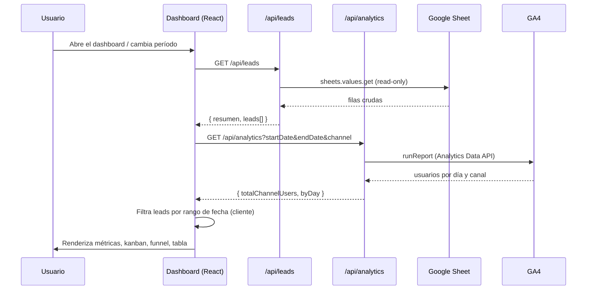
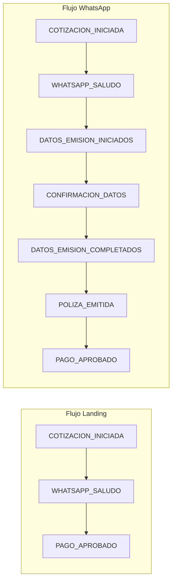

# Flujo de datos

> Última actualización: junio 2026

## Secuencia de carga del dashboard

## Funnel de conversión (lógica de negocio)

Dos flujos posibles según el canal de origen del lead:

**Nota clave:** `WHATSAPP_SALUDO` no es un estado "frío" — implica que el lead **ya cotizó** en la landing. El saludo es la primera interacción de la IA de WhatsApp con un lead que ya entregó sus datos iniciales.

## Variables de entorno requeridas

| Variable | Usado por | Descripción |
|---|---|---|
| `GOOGLE_SERVICE_ACCOUNT_EMAIL` | `lib/sheets.js`, `lib/analytics.js` | Email de la cuenta de servicio |
| `GOOGLE_PRIVATE_KEY` | `lib/sheets.js`, `lib/analytics.js` | Llave privada (rotar periódicamente) |
| `SHEET_ID` | `lib/sheets.js` | ID del Google Sheet de leads |
| `SHEET_NAME` | `lib/sheets.js` | Nombre de la pestaña (ej. `Hoja 1`) |
| `GA4_PROPERTY_ID` | `lib/analytics.js` | Property ID numérico de GA4 |

## Caché

- `/api/leads` — `s-maxage=300` (5 min) en el edge de Vercel
- `/api/analytics` — `s-maxage=120` (2 min)

El botón "Actualizar" del dashboard fuerza una nueva petición desde el cliente, pero puede seguir sirviendo la respuesta cacheada de Vercel hasta que expire.
