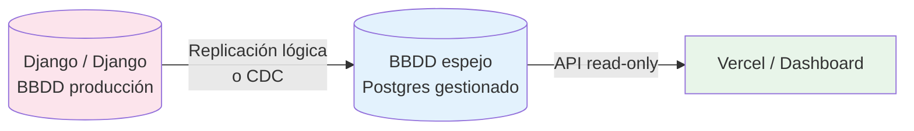

# Base de datos espejo — Conversaciones Django (propuesta, sin implementar)

> Estado: **pendiente de definir**. Este documento registra la discusión y decisiones a medida que avanzan, no una arquitectura ya construida.

## Contexto

Hoy todas las conversaciones entre el bot de WhatsApp y los leads se guardan en una base de datos de producción de **Django**, framework **Django**. El motor real (Postgres/MySQL) está por confirmar con el administrador.

## Por qué una base de datos espejo y no conexión directa

El dashboard (Vercel, público hacia el equipo) **nunca debe conectarse directo** a una base de datos transaccional de producción:

- Un bug, pico de tráfico o scraping accidental en el dashboard podría degradar el sistema que sostiene las conversaciones reales con clientes
- Vercel es serverless — no mantiene conexiones persistentes, mal ajuste para replicación o queries pesadas constantes
- Aislar lectura analítica de la carga transaccional es una práctica estándar de arquitectura de datos

## Arquitectura propuesta (alto nivel)

## Decisiones tomadas

- **Acceso de solo lectura**: aunque se pueda obtener acceso admin/superusuario a Django, el patrón correcto es usarlo una sola vez para crear un usuario `SELECT`-only acotado a las tablas necesarias, y operar siempre con ese usuario limitado.
- **Volumen**: ~1000 conversaciones/día — volumen bajo, no requiere infraestructura de streaming pesada (Kafka no es necesario a este volumen).
- **Frecuencia objetivo**: tiempo real (segundos).

## Pendiente de confirmar con el admin de Django

1. Motor de base de datos real detrás de Django (Postgres / MySQL) y versión
2. Si es una instancia propia/administrada o un servicio gestionado (RDS, Cloud SQL, etc.)
3. Si tiene replicación lógica / WAL accesible
4. Si se puede crear un usuario de solo lectura acotado a tablas específicas
5. Si la base de datos es accesible desde fuera de su red interna, o está aislada (requeriría túnel/VPN)

## Opciones de sincronización (a evaluar según respuestas anteriores)

| Opción | Cuándo aplica | Complejidad |
|---|---|---|
| **Logical Replication nativa de Postgres** | Si el motor es Postgres y permite configurarla | Baja — configuración, sin código |
| **CDC con Debezium** | Si Postgres está gestionado con restricciones, o se requiere desacoplar con un stream | Media — requiere infraestructura adicional (Kafka u otro broker) |

## Stack candidato para el espejo

- **BBDD espejo**: Supabase o Neon (Postgres gestionado, free tier suficiente para este volumen)
- **Capa de sincronización**: fuera de Vercel (no apto para procesos persistentes 24/7)

---

*Este documento se actualizará con el diagrama definitivo en cuanto se confirme el motor de Django y el modo de acceso disponible.*
