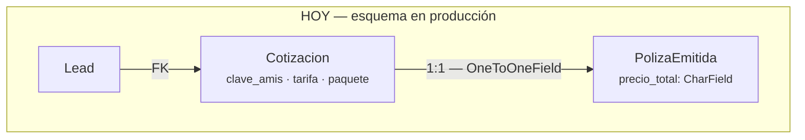
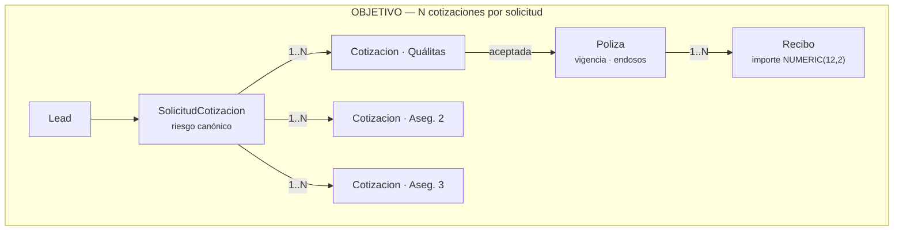
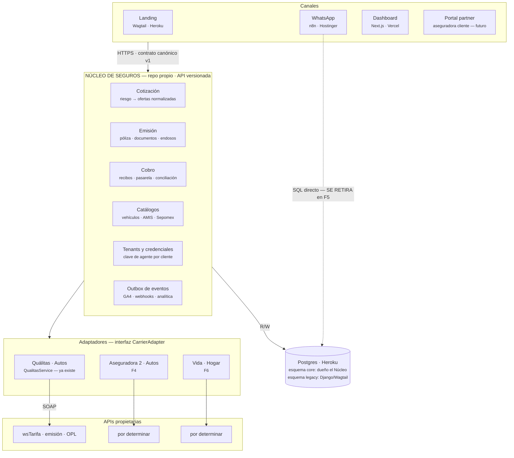

# De una clave de agente a un núcleo de seguros — roadmap multi-aseguradora / multi-ramo

> **Encargo de Alberto (25 ago 2026):** hoy Insurmind cotiza, emite y cobra pólizas de Quálitas con
> la clave de agente de Hylant. La visión es poder cotizar otras aseguradoras del mismo ramo (autos),
> incorporar otros ramos (vida, hogar), **o vender suelto sólo el módulo de emisión o de cobro** a
> una aseguradora. Pregunta literal: *«¿quizás necesito salir de Hostinger y mover todo al mismo VPS?
> ¿Me falta una capa middleware?»*
>
> **Todo el diagnóstico de este documento está medido el 25 ago 2026 contra
> `aguayo-co/HYL-WAI`, rama `main` del clon local, commit `640709e`.** Nada viene de memoria.
>
> **Documento consultivo.** No ordena ejecución. Artefacto visual:
> <https://claude.ai/code/artifact/ce25e025-4277-4285-8b60-e7c491727d0d>

---

## 1. Decisiones de Alberto que fijan este roadmap

Preguntadas y respondidas el 25 ago:

| Pregunta | Respuesta de Alberto |
|---|---|
| ¿Cómo se vende el módulo suelto? | **Aún no decidido — las dos** (SaaS multi-tenant o licencia instalada) |
| ¿De quién es la clave de agente al emitir? | **La del cliente — BYO-credencial** |
| ¿Qué ocurre primero en 12 meses? | **2ª aseguradora en autos (comparador)** |
| ¿Quién toca el Django de HYL-WAI? | *«Lo que recomiendes para que escale. Se puede hablar con Juan»* → recomendación en §6 |

---

## 2. El diagnóstico: el acoplamiento no está donde parece

La intuición natural es que estamos atados a Quálitas por la integración SOAP. **Es al revés: la
integración es la parte sana; lo que está atado es el modelo de datos.**

| Dónde miré | Qué encontré | Veredicto |
|---|---|---|
| `qualitas/services.py`; `grep -l 'zeep\|wsdl' qualitas/*.py` | `class QualitasService`. **Único** fichero de la app con SOAP | ✅ **Aislado.** Ya es un adaptador sin saberlo |
| `qualitas/models.py:2057` `class Cotizacion` | `clave_amis`, `nva_amis`, `tarifa`, `paquete`, `valor_uno`, `valor_dos`, `qualitas_percentage` | 🔴 El modelo de datos **es** Quálitas. Columnas de un solo emisor, aplanadas |
| `grep 'aseguradora\|carrier\|ramo' qualitas/models.py` | 1 sola coincidencia en 5.006 líneas, y es `poliza_anterior_aseguradora` (texto libre del cliente) | 🔴 **«Aseguradora» y «ramo» no existen como concepto.** No hay dónde colgar la segunda |
| `qualitas/models.py:2299` `class PolizaEmitida` | `cotizacion = OneToOneField(Cotizacion)` | 🔴 **Bloqueante.** Un lead no puede tener dos cotizaciones comparables: el comparador no cabe en el esquema |
| `precio_total`, `primer_pago`, `monto_subsecuente` | Declarados `CharField` | 🔴 **Bloqueante.** Un módulo de cobro con dinero en texto no se vende dos veces |
| `qualitas/urls.py` | `/api/emitir-externo/`, `/api/cotizacion/detalle/`, `/api/v1/discounts/*` | 🟡 Embrión de superficie externa, sin versionado coherente ni auth sana (`HYL-WAI#119`, `#130`) |
| n8n · nodo Sonnet, `systemMessage` | El conocimiento de producto (coberturas, deducibles, objeciones) vive redactado en el prompt | 🔴 **No compone.** Cada aseguradora nueva multiplica prompts. No llega a dos ramos |
| n8n → Postgres | n8n escribe `whatsapp_sessions` y `n8n_chat_histories` por SQL directo | 🔴 **Sin frontera.** Dos sistemas comparten tablas: no hay nada recortable que entregar a un tercero |

Las dos últimas filas son las que deciden si esto llega a ser un producto. Las otras son trabajo de
esquema: caro, pero conocido. **Un módulo vendible es, literalmente, una frontera** — y hoy no hay
ninguna: n8n y Django son el mismo sistema unidos por una base de datos.

---

## 3. El cambio estructural: un padre y una relación rota

Todo el comparador multi-aseguradora depende de un solo cambio de esquema: interponer una
**solicitud padre** por encima de la cotización, y convertir el `OneToOneField` póliza↔cotización en
una clave foránea normal. Sin eso no hay sitio físico donde guardar la segunda oferta.

*Un lead = una cotización = una póliza. Comparar dos aseguradoras exige dos cotizaciones vivas: no caben.*

`Cotizacion` **conserva su nombre y sus columnas Quálitas**. Lo que se añade es un padre que agrupa
ofertas y la ruptura del `OneToOne` con la póliza. Los importes pasan de texto a decimal en la misma
migración. El comparador nace ahí: en dos filas de una tabla, no en dos sistemas.

---

## 4. Arquitectura objetivo

La capa que falta tiene nombre y frontera concretos: un **Núcleo de Seguros** que expone un contrato
canónico de *cotizar / emitir / cobrar*, con un adaptador por aseguradora detrás. `QualitasService`
se convierte en el primero de ellos **sin reescribirse**.

Hay una arista que **desaparece**, y es tan importante como las que se añaden: n8n deja de escribir
SQL directo en Postgres. Mientras esa flecha exista, no hay nada recortable que vender.

Nada cambia de sitio por gusto: los canales siguen donde están, Postgres sigue siendo la misma
instancia. **Lo único que se interpone es una API versionada, y lo único que se corta es el acceso
directo de n8n a la base de datos.**

### 4.1 El patrón concreto: canónico estrecho + sobre crudo

No intentar normalizar todo Quálitas. Normalizar **sólo lo que hace falta para comparar y para
cobrar**; todo lo demás viaja en un `carrier_data JSONB` que el adaptador sabe leer y nadie más toca.
Un canónico ambicioso construido con una sola aseguradora en la mano es ficción con forma de esquema.

---

## 5. Respuesta a las dos hipótesis de Alberto

### 5.1 «¿Salir de Hostinger y mover todo al mismo VPS?» — **No, y sería un paso atrás**

Hoy hay PaaS gestionado en las dos piezas que importan (Heroku para Django y Postgres, Vercel para el
Dashboard) y sólo n8n en VPS. Consolidar todo en un VPS cambia un problema que no existe —latencia
entre componentes, irrelevante frente a los segundos que tarda el SOAP de Quálitas— por uno que sí
duele: operar nosotros parches, backups y uptime.

**Dónde vive n8n no es lo que impide vender un módulo de cobro. Lo que lo impide es que n8n escribe
en nuestras tablas.**

Sí hay una razón real para tocar Hostinger, y es otra: el backup automático de n8n está
descontinuado (`docs/architecture/backup-policy-n8n.md`) y la instancia no está en infraestructura
como código. Eso es recuperación ante desastre, no arquitectura — **merece su propio ticket, no este
roadmap**.

### 5.2 «¿Me falta una capa middleware?» — **Sí, pero «middleware» a secas no ayuda**

Lo que falta es un **contrato canónico con adaptadores**: una API que hable de riesgos, coberturas,
ofertas, pólizas y recibos —sin decir «AMIS» ni «paquete AMPLIA»— y detrás, un traductor por
aseguradora.

### 5.3 Sobre el «aún no decidido / las dos»

SaaS multi-tenant frente a licencia instalada **no es una decisión de arquitectura** si se hace una
cosa: que **la credencial de aseguradora sea un atributo del tenant, no una variable de entorno del
despliegue**. Con eso, «licencia instalada» pasa a ser *un despliegue con un solo tenant*, y la
decisión comercial se puede aplazar años sin coste técnico.

Como Alberto eligió **BYO-credencial**, esto deja de ser opcional y se convierte en **requisito de la
F3**. Es la única pieza de multi-tenancy que hay que construir pronto.

---

## 6. Recomendación de capacidad (la pieza que Alberto delegó)

La respuesta correcta cambia según la fase:

- **F0, F1 y F2 se hacen dentro de HYL-WAI, con Juan.** Son migraciones de base de datos sobre tablas
  que él conoce y que están bajo gobernanza Contract-First. Sacarlas a otro repo no las acelera: las
  convierte en una migración distribuida con dos dueños. **Conviene presentarle la F1 —que es casi
  gratis— antes que la F2.**
- **De la F3 en adelante, repo propio.** No por desconfianza ni por velocidad de tecleo, sino porque
  el Núcleo **es** el producto que se quiere vender, y un producto que vive dentro del repositorio de
  un tercero no se puede empaquetar ni licenciar. Que el trabajo nuevo no pase por Juan no es un
  atajo organizativo: **es la forma del activo.**

Coste que hay que aceptar con los ojos abiertos: un servicio más que operar, un contrato más que
versionar, y una frontera de red donde antes había una llamada a función. A cambio, el trabajo de dos
aseguradoras deja de competir por la misma agenda.

---

## 7. Roadmap — seis fases, ninguna un big bang

Ordenadas por dependencia real. Los plazos son de calendario, no de esfuerzo, y asumen que
Contract-First S1–S5 sigue consumiendo capacidad de Juan en paralelo.
**F0 y F1 caben hoy sin tocar superficie contractual congelada; la F2 no.**

### F0 · Higiene que no depende de ninguna decisión — *semanas 1–4*
**HYL-WAI · Juan · compatible con el freeze**

- Importes de `CharField` a `NUMERIC(12,2)`: columna paralela, doble escritura, cutover. Aditivo y reversible.
- Cerrar `HYL-WAI#130` (quitar el default de `N8N_TOKEN` y rotar) y `HYL-WAI#119` (`/api/emitir-externo/` acepta POST sin credencial).
- Escribir la especificación del contrato actual de `QualitasService` con su fingerprint. No es documentación: es la línea base contra la que se validará el adaptador.

> **Desbloquea:** todo lo relativo a cobro. Y convierte dos tickets de seguridad estancados en trabajo con justificación estratégica.

### F1 · Nombrar el dominio — *meses 2–3*
**HYL-WAI · Juan · riesgo casi nulo**

- Tablas `Aseguradora` y `Producto` (ramo × aseguradora × paquete), con una única fila: `qualitas / autos`.
- FK con default en `Cotizacion` y `PolizaEmitida`. La migración de datos es un `UPDATE` sin condiciones.

> **Desbloquea:** a partir de aquí «aseguradora» existe como concepto y hay dónde colgar la segunda. Mejor relación coste/opciones de todo el roadmap.

### F2 · Romper el 1:1 — *meses 3–5* ← **la fase que compra el comparador**
**HYL-WAI · Juan · exige ventana coordinada**

- `SolicitudCotizacion` como padre; `Cotizacion` pasa a ser hija, una por aseguradora y paquete.
- `PolizaEmitida.cotizacion`: `OneToOneField` → `ForeignKey`.
- Vistas de compatibilidad en Postgres para que n8n y el Dashboard no se enteren el mismo día. Se retiran cuando cada consumidor migre.

> **Precondición:** que no haya SHAs congelados de Contract-First sobre esas tablas. **Se negocia con Juan antes de planificarlo, no después.**

### F3 · Extraer el Núcleo — *meses 4–7, solapa con F2*
**Repo nuevo, nuestro · no bloquea a Juan**

- `QualitasService` se mueve **tal cual** detrás de la interfaz `CarrierAdapter`: cotizar, emitir, recibos, documentos. Sin reescribir el SOAP.
- **Credenciales por tenant desde el primer commit**, aunque sólo exista un tenant (requisito de la decisión BYO).
- Django deja de importar `services.py` y llama por HTTP. Estrangulamiento por partes: cotización primero, emisión después, cobro al final.
- **La base de datos sigue siendo la misma instancia Postgres, en esquema propio.** Separar el código antes que los datos; al revés es el error clásico que convierte un refactor en una migración distribuida.
- El módulo de cotización llama a los adaptadores **en paralelo** y devuelve resultados parciales. Se diseña aquí, no se parchea en la F4.

> **Desbloquea:** el módulo empieza a existir como cosa entregable, y el trabajo deja de pasar por el cuello de botella de un solo desarrollador.

### F4 · Segunda aseguradora en autos — *meses 7–10*
**Repo del Núcleo · segundo adaptador**

- Adaptador nuevo contra el canónico. El comparador pasa a ser una funcionalidad de interfaz, no un proyecto.
- **Presupuestar re-trabajo del canónico.** Aquí se descubre todo lo que no cubría: es sano, y es señal de que se diseñó con datos y no con imaginación.

> **Desbloquea:** mejor precio en pantalla, que es lo que convierte. Primera fase visible desde el negocio.

### F5 · n8n deja de escribir en Postgres — *meses 6–11, en paralelo*
**Agente-n8n + Núcleo · sin esto no hay producto**

- El bot consume la API del Núcleo en lugar de `INSERT`/`UPDATE` directos sobre `whatsapp_sessions`.
- El estado conversacional pasa a ser propiedad de un servicio, con su contrato — y muere la clase de bug que lleva meses dejando `conversation_phase` atascado en `greeting`.
- El conocimiento de producto sale del `systemMessage` y pasa a catálogo consultable, para que el prompt se **componga** por producto en vez de multiplicarse.

> **Desbloquea:** la frontera. Un módulo vendible es exactamente esto: un sistema que se puede recortar porque nadie de fuera toca sus tablas.

### F6 · Segundo ramo: vida u hogar — *mes 10 en adelante*
**Núcleo · modelo de riesgo polimórfico**

- `ObjetoDeRiesgo` polimórfico: vehículo, inmueble, persona. Punto en el que el esquema deja de hablar de coches.
- Bot componible por producto. **Sin la F5 esta fase no se puede intentar**: el prompt monolítico no admite dos ramos.

> **Desbloquea:** venta cruzada sobre la cartera existente, el margen más barato disponible.

---

## 8. Lo más urgente de esta lista no es técnico

Antes de la F3 hace falta **la documentación técnica de la segunda aseguradora en la mano**. Un
canónico diseñado con una sola implementación delante es una abstracción inventada, y se rompe en
cuanto llega la segunda — que es justo cuando ya se ha construido encima.

Es una gestión comercial, tarda meses y no depende de ningún desarrollador. **Debe empezar ahora, en
paralelo con la F0.** Es el camino crítico real del roadmap, y el único punto donde ir despacio sale
caro de verdad.

---

## 9. Riesgos, en orden de probabilidad

| Riesgo | Por qué es probable | Mitigación |
|---|---|---|
| El canónico se diseña prematuro | Es lo que hace todo el mundo: abstraer con una sola implementación delante, porque se siente productivo | Regla dura: **ningún campo entra al canónico sin dos aseguradoras que lo justifiquen.** Lo demás al `carrier_data JSONB` |
| La F2 choca con Contract-First | S1–S5 congela SHAs y superficie contractual; tocar `Cotizacion` y `PolizaEmitida` es exactamente eso | Presentar la F1 primero, y llevar la F2 como **enmienda de contrato** por la metodología ya existente con Juan, no como petición suelta |
| Se parten los datos antes que el código | «Servicio nuevo» sugiere «base de datos nueva». Es el instinto equivocado | Misma instancia Postgres, esquema propio, durante toda la F3 y la F4. Partir la BD es una decisión posterior y separada |
| La F5 se aplaza indefinidamente | No produce nada visible para el negocio: siempre habrá algo más urgente | Atarla a la F4: cada consumidor que migre a la API cuenta como entregable de fase, no como limpieza |
| Cotizar con dos aseguradoras dobla el tiempo de respuesta | El SOAP de Quálitas ya es lento; en serie, dos son insoportables en una landing | Adaptadores en paralelo con resultados parciales, diseñado en la F3 |

---

## 10. Resumen en tres frases

1. La integración SOAP con Quálitas **ya está aislada y no es el problema**; el problema es que el
   esquema de base de datos no sabe que existen las aseguradoras y no deja caber dos cotizaciones en
   un lead.
2. La capa que falta **no es un VPS ni un middleware genérico**, sino un núcleo con contrato canónico
   y adaptadores, con la credencial de aseguradora colgando del tenant en lugar del despliegue.
3. El trabajo del que depende todo lo demás **no es de código**: es conseguir la documentación de la
   segunda aseguradora, porque hasta entonces cualquier modelo canónico será una suposición.

---

## 11. Estado

- **25 ago 2026 — publicado.** Documento consultivo. **No ordena ejecución de nada.**
- **Ninguna fase está autorizada.** La F0 y la F1 son las únicas que hoy no rozan superficie
  contractual congelada de Contract-First S1–S5.
- Antes de mover la F2 hay que hablarlo con Juan como enmienda de contrato.
