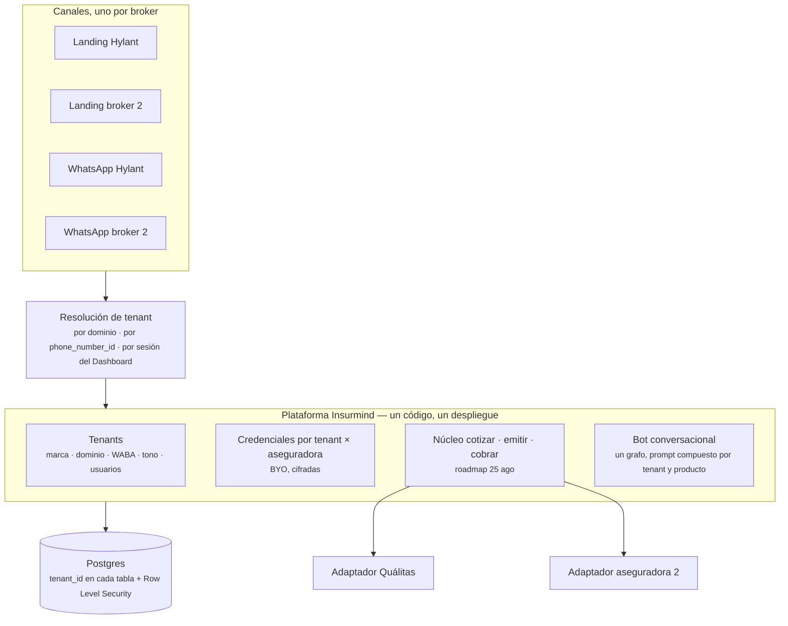

# Insurmind como SaaS multi-broker — qué hacer cuando llegue el segundo broker

> **Encargo de Alberto (2 oct 2026):** *«Hoy todo este proyecto corre para un cliente que es Hylant. ¿Qué pasa si mañana incorporo
> a otro broker como Interprotección o Ahorraseguros? ¿Crear nuevos repositorios? ¿Clonar los que ya tengo? ¿Dónde hago los nuevos
> despliegues? El objetivo de Insurmind es ser un SaaS donde fácilmente pueda incorporar nuevas aseguradoras o brokers. También me
> interesa evaluar si trabajo con algún cloud provider tipo Amazon para ir de la mano en oportunidades.»*
>
> **Es la iniciativa de Insurmind, no de Hylant.** Complementa —no sustituye— el roadmap multi-aseguradora del 25 ago
> (`2026-08-25-nucleo-multi-aseguradora-roadmap.md`), que resolvió el eje **aseguradoras**. Este documento resuelve el eje
> **brokers** (tenants) y la pregunta de **dónde se despliega**.
>
> **Documento consultivo. No ordena ejecución.** Lo medido lleva fecha y fuente; lo de proveedores cloud es orientación general
> que hay que verificar con cada proveedor antes de decidir.

---

## 1. Dos ejes, no uno

| Eje | Qué varía | Ejemplos | Dónde está resuelto |
|---|---|---|---|
| **Aseguradora** (carrier) | API de cotizar/emitir/cobrar, catálogos, productos | Quálitas, una 2ª en autos, vida/hogar | Roadmap 25 ago: núcleo con contrato canónico + un adaptador por aseguradora |
| **Broker** (tenant, el cliente que paga Insurmind) | marca, landing, número de WhatsApp, **su clave de agente** en cada aseguradora, tono, comisiones, usuarios del Dashboard, sus datos | Hylant hoy; Interprotección, Ahorraseguros mañana | **Este documento** |

Un broker nuevo que venda Quálitas **reutiliza el adaptador de Quálitas tal cual**: lo único nuevo es su configuración y su
credencial. Por eso el segundo broker es, técnicamente, más barato que la segunda aseguradora — si el sistema sabe qué es un broker.

## 2. Hoy el sistema no sabe que existen los brokers (medido el 2 oct 2026)

| Dónde | Qué hay | Fuente |
|---|---|---|
| BD de PROD | **0** columnas `tenant/broker/organization` en las 172 tablas de `public` (control positivo: 20 columnas `session_id`) | `pg_catalog`, BD PROD |
| Django, modelos | 74 modelos en `qualitas/models.py`, ninguno de broker/tenant | `aguayo-co/HYL-WAI` `origin/main` `8167391f` |
| Clave de agente Quálitas | **variable de entorno del despliegue** (`QUALITAS_AGENTE`, `QUALITAS_NO_NEGOCIO`, `hyl_wai/settings/base.py:659-662`) | idem |
| «Hylant» escrito en código | 4 ficheros `.py` fuera de migraciones y 6 plantillas `.html` | idem |
| Bot n8n PROD (`0f98767d`) | «Hylant» 22 veces, «Quálitas/Qualitas» 60, el dominio `seguroautoqualitas.com` 10, el `phone_number_id` de WhatsApp fijo en el grafo; `systemMessage` del AI Agent de ~82 000 caracteres redactado para Quálitas | API n8n PROD |
| Repos | el backend vive en la org **`aguayo-co`** (de Juan); n8n, Dashboard y agentes en `aibanez82` | GitHub |

**Lo caro no es copiar código: es que hoy el «quién es el cliente» está repartido entre variables de entorno, literales en el
código, el prompt y el número de WhatsApp.**

## 3. Respuestas directas

### 3.1 ¿Nuevos repositorios? ¿Clonar los que tengo? — **No clonar por broker**

Un repositorio por **componente**, nunca por **cliente**. Clonar el código por broker crea N copias que divergen desde el primer
arreglo, y cada bug se arregla N veces.

Lo sabemos por experiencia propia: hoy mantenemos **dos** copias del bot (STG y PROD) y ya divergen — el 2 oct, STG lleva 25 nodos
que PROD no tiene, y cada promoción exige un diff a mano. Con un bot clonado por broker, eso se multiplica por cada cliente.

Lo que sí es por broker: **configuración y datos**. Nunca código.

### 3.2 ¿Dónde se despliega? — **Dos etapas**

**Etapa puente (si el 2º broker llega antes de que exista el núcleo):** mismo código, **un despliegue por broker** («silo»):
una app y una base de datos propias, con la configuración del broker en sus variables. Es lo más rápido y aísla datos por
construcción. Coste: cada despliegue se opera aparte, y en n8n obliga a parametrizar el bot (no copiarlo). **Solo como puente.**

**Etapa objetivo — un SaaS multi-tenant:**

- **Tabla de tenants** con todo lo que hoy está disperso: marca, dominio de la landing, `phone_number_id` y token de WhatsApp, tono
  del bot, comisiones, usuarios y roles del Dashboard.
- **Credencial por tenant × aseguradora** (la decisión BYO del 25 ago): la clave de agente de Hylant en Quálitas deja de ser una
  variable de entorno.
- **Datos:** `tenant_id` en cada tabla y **Row Level Security** de Postgres, para que una consulta sin tenant no devuelva nada.
  Un cliente grande que exija base propia es *un despliegue con un tenant* — la misma decisión que «SaaS o licencia instalada».
- **Bot:** un solo grafo. Al entrar el mensaje, el tenant se resuelve por `phone_number_id` (ya existe `Phone Number ID Guard`) y se
  carga su configuración. El prompt se **compone** (tono del tenant + conocimiento del producto) en vez de copiarse.
- **Dashboard:** el usuario pertenece a un tenant; ve solo lo suyo. Hoy los roles ya existen; falta el tenant.

### 3.3 Lo que hay que resolver antes del código (no es técnico)

1. **Propiedad del código.** El backend vive en la org de Juan (`aguayo-co/HYL-WAI`). Un SaaS de Insurmind no se puede vender
   desde el repositorio de un tercero. Hablarlo con Juan **antes** de diseñar nada: ¿se transfiere, se licencia, o el núcleo nuevo
   nace en un repo de Insurmind (lo que ya recomendaba el roadmap del 25 ago desde su F3)?
2. **WhatsApp por broker.** Cada broker tendrá su número y su marca. Hay que decidir si cada uno trae su cuenta de Meta o si
   Insurmind opera como proveedor tecnológico de Meta y da de alta a sus clientes. Hoy Meta es de Juan.
3. **La clave de agente de cada broker con cada aseguradora** — la tramita el broker; Insurmind solo la guarda cifrada.
4. **Datos personales.** Varios brokers en la misma plataforma exigen contrato de encargado de tratamiento con cada uno y
   aislamiento demostrable entre ellos (Row Level Security + auditoría). Revisarlo con abogado bajo la ley mexicana vigente.
5. **El primer broker real.** Igual que la 2ª aseguradora en el roadmap: diseñar la tenencia con un solo cliente delante produce
   abstracciones inventadas. Con Interprotección o Ahorraseguros sobre la mesa se diseña sobre lo que de verdad cambia.

## 4. ¿Un proveedor cloud? — orientación, a verificar

**Sí tiene sentido elegir uno**, pero por la razón correcta: el valor no está en el hosting (Heroku, Vercel y el VPS funcionan) sino
en **vender de la mano** — programas de co-venta, marketplace donde el cliente paga con el compromiso de gasto que ya tiene con esa
nube, y créditos para empezar.

| | AWS | Google Cloud | Azure |
|---|---|---|---|
| Región en México | sí (Querétaro) | sí (Querétaro) | sí (Querétaro) |
| Claude disponible | Amazon Bedrock | Vertex AI | Microsoft Foundry |
| Venta conjunta y marketplace | programa ISV de co-venta + AWS Marketplace | programa de partners + Google Cloud Marketplace | programa de co-venta + Azure Marketplace |
| Programa para startups | créditos (Activate) | créditos (Google for Startups) | créditos (Microsoft for Startups) |

Criterios para elegir, por orden:

1. **¿En qué nube están las aseguradoras y brokers a los que quieres vender?** Co-vender con la nube que ya usa tu comprador es lo
   que abre puertas; con otra, no.
2. **Claude por la nube elegida** (Bedrock, Vertex o Foundry): el gasto de IA se factura dentro del mismo contrato y puede contar
   para el compromiso de gasto del cliente si compra por marketplace.
3. **Datos en México** si algún cliente lo exige.

**Cuándo migrar:** no ahora. Mover Heroku, Vercel y n8n a una nube es un proyecto por sí mismo y no acerca al segundo broker. Lo
natural es que **el núcleo nuevo** nazca ya en la nube elegida y el resto migre por partes. Hablar con los programas de partners sí
puede empezar ya: es gestión comercial, no técnica.

## 5. Siguiente paso propuesto

1. Alberto: conversación con Juan sobre propiedad del código (§3.3.1). Es el bloqueante.
2. Alberto: identificar el primer broker candidato y su calendario. Decide si hace falta la etapa puente.
3. Arquitecto: con el broker identificado, diseño de la tabla de tenants y del mapa «qué es de cada broker» contra el sistema real.
4. Alberto: primera conversación con los programas de partners de la nube donde estén sus compradores.

## 6. Estado

- **2 oct 2026 — registrada.** Consultiva. Ninguna fase autorizada.

Agente: Arquitecto-IA-Qualitas
